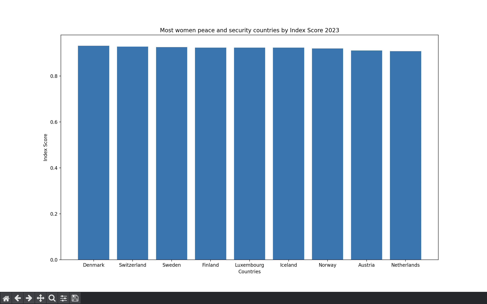

# Women peace and security countries graps
To run the program you must execute the script "main.py". Once the main script is executed you will need to specify which graph you want to see, whether the countries with the highest score or the countries with the lowest score in the index of peace and security for women in the countries of the world.

Make sure you have installed the appropriate dependencies in the virtual environment by running:
```
pip install
```
**You will be able to see a graph like this:**

